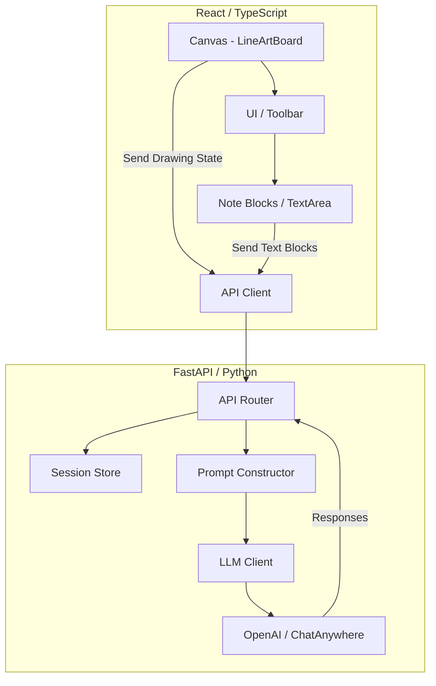

## 🧠 AIpad — Intelligent Multimodal Sketchpad & Note System

**AIpad** is a full-stack **AI-assisted drawing and note system** built with **FastAPI + React + TypeScript**, integrating **multimodal perception**, **contextual reasoning**, and **interactive generation**.

It enables users to draw, edit, and reason over sketches and notes with the support of large vision-language models.
Everything from **line understanding**, **shape recognition**, to **semantic note composition** is already implemented.

---

### 🧩 Core Features

#### 🖊️ 1. Interactive Canvas (LineArtBoard)

* Infinite canvas with pan & zoom
* Brush, eraser, shape tools (ellipse, rectangle, line)
* Layer-based rendering with undo/redo
* Smart stroke snapping and correction
* Real-time AI-assisted completion — model predicts and adds missing elements

#### 🧠 2. AI Reasoning & Vision Integration

* Full multimodal pipeline (implemented):

  * **Visual analysis** → **structural interpretation** → **generation command**
* Model modes:

  * `light`: language-only mode
  * `full`: text-vision hybrid reasoning
  * `vision`: full multimodal understanding via image input
* LLM Gateway compatible with OpenAI and ChatAnywhere APIs
* Dynamic prompt constructor (`prompting.py`) managing multi-stage pipelines
* Context summarization + compression for long sessions

#### 🗂️ 3. Structured Note System

* Supports **text blocks, sketch blocks, and hybrid notes**
* Bi-directional sync between visual canvas and text area
* Editable and draggable note items
* Hierarchical block management (semantic + layer context)
* Auto-generated structure: title, layout, relations

#### 🧮 4. Contextual Session Engine

* In-memory session store with persistence
* Automatic incremental updates
* Snapshot recovery and version history
* Compression & summarization to prevent token overflow
* Seamless integration with LLM context for continuous reasoning

#### 🔍 5. Unified Architecture

* Modular backend (FastAPI) and fully decoupled frontend (React + Vite)
* Shared schema via `Pydantic`
* Extensible model connector supporting multiple AI providers
* Event-driven architecture with real-time updates
* Comprehensive logging: prompts, responses, image states

---

### 🧱 System Architecture



---

### 🗂️ Project Structure

```bash
AIpad/
├── app/
│   ├── main.py               # FastAPI entrypoint
│   ├── schemas.py            # Data schemas (Pydantic)
│   ├── prompting.py          # Multi-stage prompt builder
│   ├── llm_client.py         # AI model connector
│   ├── session_store.py      # Context and session manager
│   ├── routers/
│   │   ├── ai_router.py      # AI inference endpoints
│   │   ├── note_router.py    # Note sync API
│   │   └── vision_router.py  # Image processing
│   └── utils/
│       ├── logging_utils.py
│       └── compression.py
│
├── src/
│   ├── components/
│   │   ├── LineArtBoard.tsx   # Main interactive canvas
│   │   ├── Toolbar.tsx        # Tool control panel
│   │   ├── NoteEditor.tsx     # Text block editor
│   │   └── ContextMenu.tsx
│   ├── hooks/
│   │   └── useSession.ts      # Frontend context management
│   ├── services/
│   │   └── apiClient.ts       # Backend communication
│   ├── App.tsx
│   ├── main.tsx
│   └── styles/
│       ├── canvas.css
│       └── app.css
│
├── .env.example
├── requirements.txt
├── package.json
└── README.md
```

---

### ⚙️ Installation & Run

#### 1️⃣ Clone

```bash
git clone https://github.com/Jinnn2/AIpad.git
cd AIpad
```

#### 2️⃣ Backend Setup

```bash
cd app
python -m venv venv
source venv/bin/activate   # Windows: venv\Scripts\activate
pip install -r requirements.txt
cp .env.example .env
# Fill in your OpenAI API key and other configs
uvicorn main:app --reload
```

Backend runs at: **[http://127.0.0.1:8000](http://127.0.0.1:8000)**

#### 3️⃣ Frontend Setup

```bash
cd ../src
npm install
npm run dev
```

Frontend default: **[http://localhost:5173](http://localhost:5173)**

---

### 🧾 Environment Variables

| Variable         | Description                   | Example                     |
| ---------------- | ----------------------------- | --------------------------- |
| `OPENAI_API_KEY` | API key for model access      | `sk-xxxx`                   |
| `MODEL_BASE_URL` | Base URL of AI service        | `https://api.openai.com/v1` |
| `LLM_MODE`       | Model mode                    | `light` / `full` / `vision` |
| `SESSION_PATH`   | Directory for session storage | `./sessions/`               |

---

### 🧭 Development Notes

* **Type-safe APIs** ensured via shared schemas between backend and frontend.
* **Prompt pipelines** allow for multi-turn structured reasoning.
* **Vision mode** performs two-stage interpretation: visual → symbolic → textual.
* **Session persistence** makes context recovery possible after reload.
* **Error handling** with detailed FastAPI middleware + client interceptors.

---

### 🧱 Tech Stack

| Layer         | Technology                           |
| ------------- | ------------------------------------ |
| Frontend      | React, TypeScript, Konva.js, Vite    |
| Backend       | FastAPI, Pydantic, Uvicorn           |
| AI Engine     | OpenAI / ChatAnywhere                |
| Storage       | In-memory + file-based session store |
| Communication | RESTful JSON APIs                    |
| Build Tools   | npm, Python venv                     |

---

### 🧩 Extensibility

* Add new models: extend `llm_client.py`
* Customize prompts: modify `prompting.py`
* New block types: extend `NoteEditor` & schemas
* Session storage: switch to Redis or Postgres
* Integrate WebSocket for real-time sync (already scaffolded)

---

### 🧪 Testing

```bash
pytest app/tests
npm run test
```

Includes unit tests for backend routes and frontend hooks.

---

### 🧬 Roadmap (Current Completion ✓)

| Feature                       | Status                     |
| ----------------------------- | -------------------------- |
| Drawing Canvas & Tools        | ✅                          |
| Undo / Redo                   | ✅                          |
| Vision-based AI Completion    | ✅                          |
| Text Block Editing & Sync     | ✅                          |
| Contextual Session Management | ✅                          |
| Multimodal Reasoning          | ✅                          |
| Snapshot & Replay             | ✅                          |
| Multi-agent Workflow          | ✅ (integrated in pipeline) |

---

### 🧠 Author & License

* **Author:** [@Jinnn2](https://github.com/Jinnn2)
* **License:** MIT
* **Contact:** (add your preferred email or homepage)

