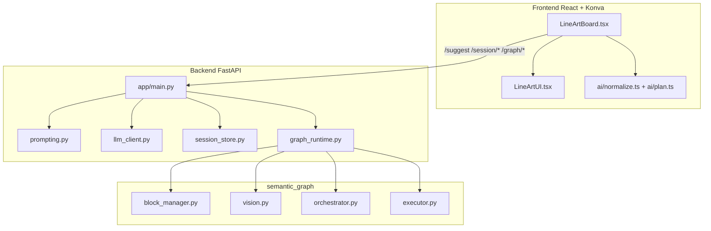
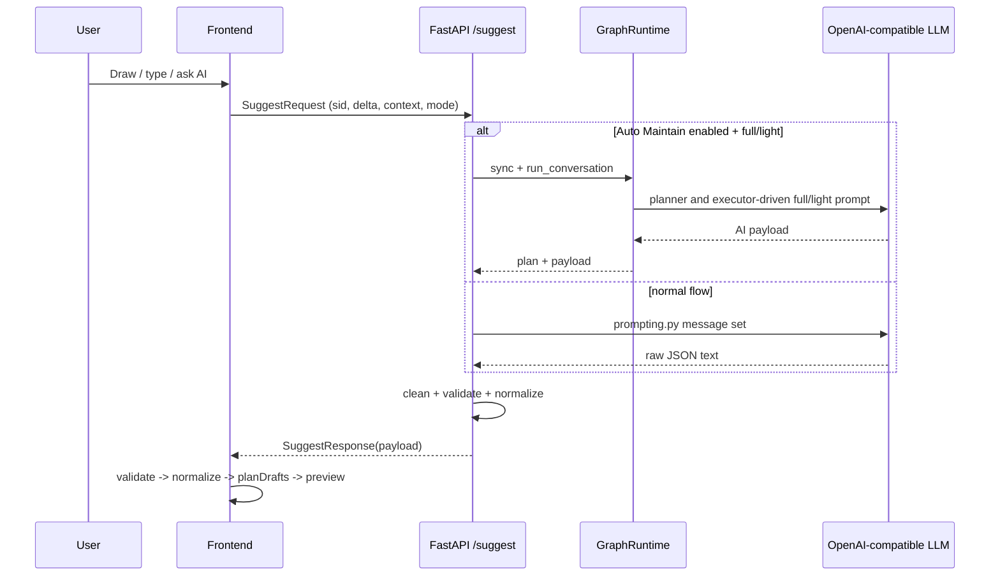

# AIPAD

AI-first canvas workspace for drawing, writing, and structured semantic maintenance.

`AIPAD` is not just a "next-stroke generator". It combines:

- interactive canvas authoring (draw + text + edit),
- multi-mode LLM generation (`light` / `full` / `vision`),
- and an Auto Maintain semantic graph that continuously organizes content into `fragment -> group -> block`.

Runtime project: `lineart-board/`

---

## Table of Contents

- [Why AIPAD](#why-aipad)
- [Core Highlights](#core-highlights)
- [System Architecture](#system-architecture)
- [Generation Modes](#generation-modes)
- [Auto Maintain Pipeline](#auto-maintain-pipeline)
- [Repository Structure](#repository-structure)
- [Quick Start](#quick-start)
- [API Surface](#api-surface)
- [Configuration](#configuration)
- [Observability and Debugging](#observability-and-debugging)
- [Current Status](#current-status)

---

## Why AIPAD

Most whiteboard assistants only produce local suggestions. AIPAD is designed for long-running sessions where context quality matters.

What differentiates this project:

1. Structured memory, not only generation.
2. Planner + executor context routing before FULL prompting.
3. Automatic semantic clustering and block evolution during interaction.
4. Text-first and drawing-first workflows in the same canvas protocol.

---

## Core Highlights

| Area | Implemented Capabilities |
| --- | --- |
| Canvas Interaction | Pen, line, poly, ellipse, eraser, text, selection, drag, pan/zoom, undo/redo |
| AI Suggestion | `/suggest` with `light`, `full`, `vision`; validated and normalized payload pipeline |
| Vision 2.0 | Two-step flow: image analysis (step1) -> instruction-guided generation (step2) |
| Text Workflow | Editable text box, summary field, grow direction, style presets (`body/subtitle/title`), `:::` autocomplete |
| Auto Maintain | Graph auto-mode, grouping/promoting, block summaries, block relationships, promote-group action |
| Reliability | Output cleaning, invalid color fallback mapping, strict schema validation, detailed IO logging |

---

## System Architecture


```mermaid
graph TD
    subgraph FE[Frontend React + Konva]
        A[LineArtBoard.tsx]
        B[LineArtUI.tsx]
        C[ai/normalize.ts + ai/plan.ts]
        A --> B
        A --> C
    end

    subgraph BE[Backend FastAPI]
        D[app/main.py]
        E[prompting.py]
        F[llm_client.py]
        G[session_store.py]
        H[graph_runtime.py]
    end

    subgraph SG[semantic_graph]
        I[block_manager.py]
        J[vision.py]
        K[orchestrator.py]
        L[executor.py]
    end

    A -->|/suggest /session/* /graph/*| D
    D --> E
    D --> F
    D --> G
    D --> H
    H --> I
    H --> J
    H --> K
    H --> L
```

### End-to-end Suggestion Flow


```mermaid
sequenceDiagram
    participant U as User
    participant FE as Frontend
    participant API as FastAPI /suggest
    participant GR as GraphRuntime
    participant LLM as OpenAI-compatible LLM

    U->>FE: Draw / type / ask AI
    FE->>API: SuggestRequest (sid, delta, context, mode)
    alt Auto Maintain enabled + full/light
        API->>GR: sync + run_conversation
        GR->>LLM: planner and executor-driven full/light prompt
        LLM-->>GR: AI payload
        GR-->>API: plan + payload
    else normal flow
        API->>LLM: prompting.py message set
        LLM-->>API: raw JSON text
    end
    API->>API: clean + validate + normalize
    API-->>FE: SuggestResponse(payload)
    FE->>FE: validate -> normalize -> planDrafts -> preview
```

---

## Generation Modes

| Mode | Intent | Context Strategy | Typical Output |
| --- | --- | --- | --- |
| `light` | Fast next-step completion | Compressed context, minimal tokens | One concise stroke (or compact output) |
| `full` | Rich reasoning and editing | Full canvas protocol + planner hints + block outline | Multi-stroke draw/write/edit |
| `vision` | Image-informed generation | Canvas snapshot + instruction fusion | Scene-aware stroke/text continuation |

Notes:

- `vision_version >= 2` uses two-stage processing.
- FULL mode supports `tool='text'` and `tool='edit'` with strict meta contract.

---

## Auto Maintain Pipeline

Auto Maintain is enabled from UI in FULL mode and uses `/graph/auto-mode`.

### Internal Lifecycle

1. Frontend sends initial canvas snapshot and strokes.
2. Backend converts strokes into fragments.
3. `VisionGrouper` and `BlockManager` maintain pending groups.
4. Stable groups are promoted into semantic blocks.
5. Planner outputs: `action`, `targetBlockIds`, `nextStepHint`.
6. Executor selects block context and composes FULL/LIGHT prompt.
7. Generated content is re-ingested, keeping the graph up to date.

### Context Selection Order (Executor)

1. `plan.targetBlockIds`
2. `context.active_block_ids`
3. `context.main_block_id`
4. Most recently updated blocks
5. Relationship expansion (related blocks)

### Current clustering defaults (distance-priority tuned)

- `GRAPH_VISION_STROKE_THRESHOLD=6`
- `GRAPH_VISION_SPATIAL_THRESHOLD=280.0`
- `GRAPH_VISION_AUTO_PROMOTE_CONFIDENCE=0.92`
- `GRAPH_BLOCK_GROUP_DISTANCE_THRESHOLD=0.45`
- `GRAPH_BLOCK_BLOCK_DISTANCE_THRESHOLD=0.40`
- `GRAPH_BLOCK_AUTO_PROMOTE_GROUP_SIZE=7`

---

## Repository Structure

```text
lineart-board/
  app/
    main.py                       # FastAPI routes and payload cleaning
    graph_runtime.py              # orchestration runtime bridge
    prompting.py                  # FULL/LIGHT/VISION prompt templates
    prompting.full.original.py    # backup copy for FULL prompt evolution
    llm_client.py                 # chat-completions wrapper + logging
    session_store.py              # in-memory session + stroke minify
    embedding_client.py           # embedding calls
    schemas.py                    # shared protocol models
  semantic_graph/
    block_manager.py              # clustering/promotion/summary logic
    vision.py                     # stroke group batching and decisions
    orchestrator.py               # planner behavior + action semantics
    executor.py                   # selected blocks -> prompt context
    models.py
    state.py
  src/
    LineArtBoard.tsx              # main interaction + request lifecycle
    LineArtUI.tsx                 # toolbars/panels/graph views
    ai/
      types.ts
      normalize.ts
      plan.ts
      draw.ts
    textbox/layout.ts             # text wrapping and grow-direction layout
  logs/                           # request/response/LLM diagnostics
```

---

## Quick Start

### Prerequisites

- Python 3.10+ (conda env recommended)
- Node.js 18+
- Valid OpenAI-compatible API key

### 1) Backend

```powershell
cd lineart-board
conda activate lineart
python -m uvicorn app.main:app --reload --reload-exclude "logs" --host 0.0.0.0 --port 8000
```

Backend: `http://localhost:8000`

### 2) Frontend

```powershell
cd lineart-board
npm install
npm run dev
```

Frontend: `http://localhost:5173`  
Some environments use IPv6 loopback: `http://[::1]:5173`.

---

## API Surface

| Method | Path | Purpose |
| --- | --- | --- |
| `GET` | `/health` | service and model config heartbeat |
| `POST` | `/suggest` | main draw/write/edit generation endpoint |
| `POST` | `/completion` | text completion for textbox workflow |
| `POST` | `/session/init` | initialize session and return `sid` |
| `POST` | `/session/sync` | sync full stroke snapshot |
| `POST` | `/graph/auto-mode` | enable/disable Auto Maintain runtime |
| `GET` | `/graph/state?sid=...` | graph snapshot (blocks/groups/fragments) |
| `POST` | `/graph/promote-group` | manually promote pending group to block |

---

## Configuration

Config file: `lineart-board/.env`

### Required

- `OPENAI_API_KEY`
- `OPENAI_BASE_URL`
- `OPENAI_MODEL`

### Frequently tuned

- `CORS_ORIGINS`
- `LOG_IO`, `LOG_LLM`, `LOGS_DIR`
- `SESS_MAX_STROKES`, `SESS_KEEP_RECENT`, `SESS_RESAMPLE_STEP`, `SESS_QUANT`
- `PROMPT_SAMPLE_EVERY_N`

### Graph tuning

- `GRAPH_VISION_STROKE_THRESHOLD`
- `GRAPH_VISION_SPATIAL_THRESHOLD`
- `GRAPH_VISION_AUTO_PROMOTE_CONFIDENCE`
- `GRAPH_BLOCK_GROUP_DISTANCE_THRESHOLD`
- `GRAPH_BLOCK_BLOCK_DISTANCE_THRESHOLD`
- `GRAPH_BLOCK_AUTO_PROMOTE_GROUP_SIZE`

---

## Observability and Debugging

All critical path diagnostics are already instrumented.

Primary log locations: `lineart-board/logs/`

- per-request folders:
  - `input.request.json`
  - `input.messages*.json`
  - `output.cleaned.json`
  - `output.error.json`
- raw LLM dumps:
  - `llm_YYYYMMDD_HHMMSS.json`

Recommended debug path:

1. Start from latest request folder.
2. Compare request payload vs final messages.
3. Check cleaned output and schema error details.
4. Inspect corresponding `llm_*.json` raw content.

---

## Current Status

- End-to-end product flow is implemented and usable for interactive sessions.
- Auto Maintain and planner/executor integration are active.
- Main validation approach is runtime/log-driven verification.
- Dedicated unit/integration test suites are still limited in this repository.

---

If you plan to publish or demo this project, this README can be used as the project front page and technical handoff baseline.
